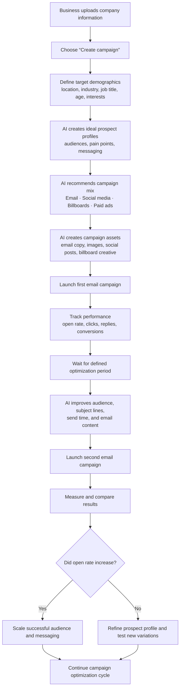

# GTM_mailOptimization

> **Working name:** `GTM_mailOptimization`
>
> **Status:** Early project documentation — open to review and changes by the team.

## Overview

GTM_mailOptimization is a campaign-planning and optimization platform. A business provides its company information, defines its intended audience, and uses AI to develop prospect profiles, recommend channels, generate campaign assets, and continuously improve email-campaign performance.

The first version of the journey prioritizes email campaign creation and optimization. The platform may later support additional channels such as social media, billboards, and paid advertising.

## Initial user journey

## Journey stages

1. **Business setup:** The business uploads company information and starts a new campaign.
2. **Audience definition:** The user specifies target demographics, including location, industry, job title, age, and interests.
3. **AI planning:** AI builds ideal prospect profiles, identifies pain points, suggests positioning and messaging, and recommends a channel mix.
4. **Asset generation:** AI prepares campaign materials, initially including email copy and potentially images, social posts, and billboard creative.
5. **First email launch:** The user launches an initial email campaign and monitors open rate, clicks, replies, and conversions.
6. **Optimization:** After a defined period, AI refines the audience, subject line, send time, and email content before launching an improved campaign.
7. **Evaluation and iteration:** The platform compares results. Improved open rates lead to scaling the audience and messaging; otherwise, it refines the prospect profile and tests new variations. Both paths repeat the optimization cycle.

## Open questions for the team

- What company information is required during initial setup?
- Which email provider(s) should the first version integrate with?
- How long is the optimization period, and can users configure it?
- Is open rate the primary success metric, or should the decision point use a combination of clicks, replies, and conversions?
- Which channels beyond email are in scope for the initial release?
- What level of user review and approval is required before AI-generated assets are launched?

## Collaboration note

This README is a starting point for team discussion. Please treat the journey, terminology, scope, and success metrics as proposed rather than final.
